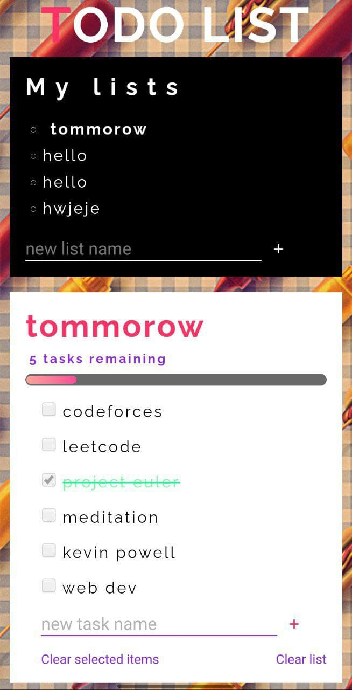

# Todo App

This web app allows the user to save their tasks.
It uses local storage object to save the data in browser.
User can view the progress bar that allows to check how many task they performed.

